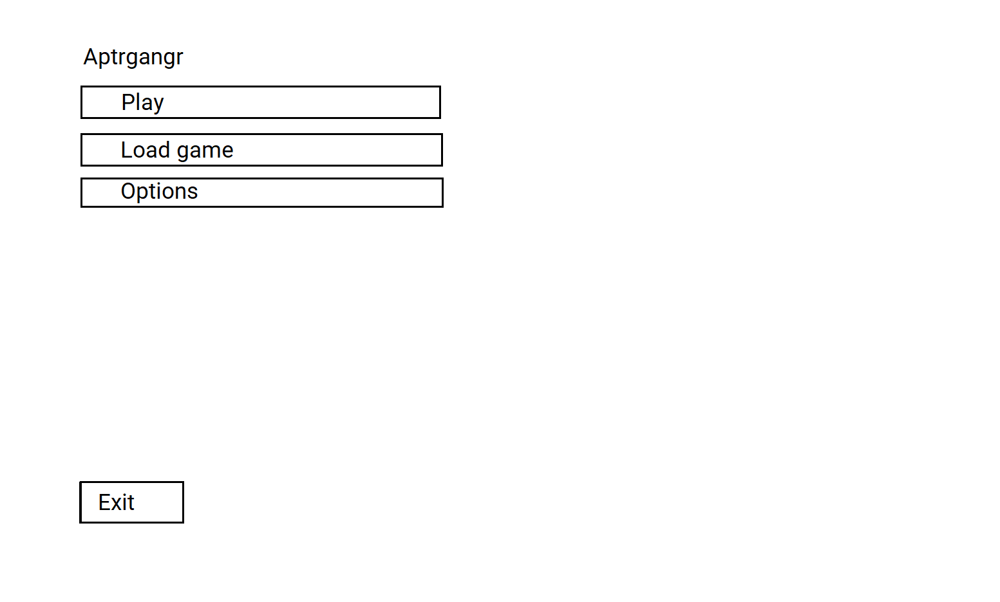
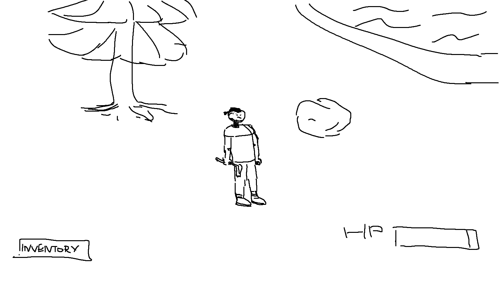

# Requirements Document
## 1. Introduction
### 1.1. Purpose 
"Aptrgangr" it is a third person free survival game with typical mechanics in this genre.
### 1.2. Analogs
* [The Long Dark](https://store.steampowered.com/app/305620/The_Long_Dark/)
* [Rust](https://store.steampowered.com/app/252490/Rust/)
* [The Forest ](https://store.steampowered.com/app/242760/The_Forest/)

## 2. User requirements
### 2.1. Programming interfaces
* Programming language - **C#**
* Game Engine - **Unity**
* IDE - **Visual Studio**
### 2.2. User interface

----------------------------------------------------

----------------------------------------------------

----------------------------------------------------

----------------------------------------------------

----------------------------------------------------

### 2.3. User characteristics
Targeted audience - any customer with free time and willing to have some entertainment.

## 3. System requirements
### 3.1. Functional requirements
#### 3.1.1 Building system
* Building defences
* Building crafting tables
#### 3.1.2 Crafting system
* Crafting tools
* Crafting weapons
#### 3.1.3 Procedural generation
* Procedural generated map
* Procedural placed objects
#### 3.1.4 Combat system
* Enemies AI
* Using different weapons
### 3.2 Non-functional requirements
#### 3.2.1. Quality attributes
* Auto-saves
* Changes to video quality
