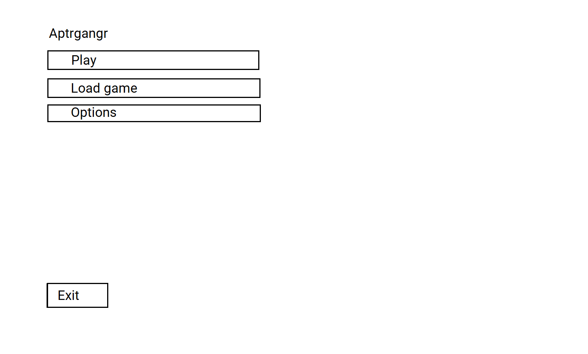
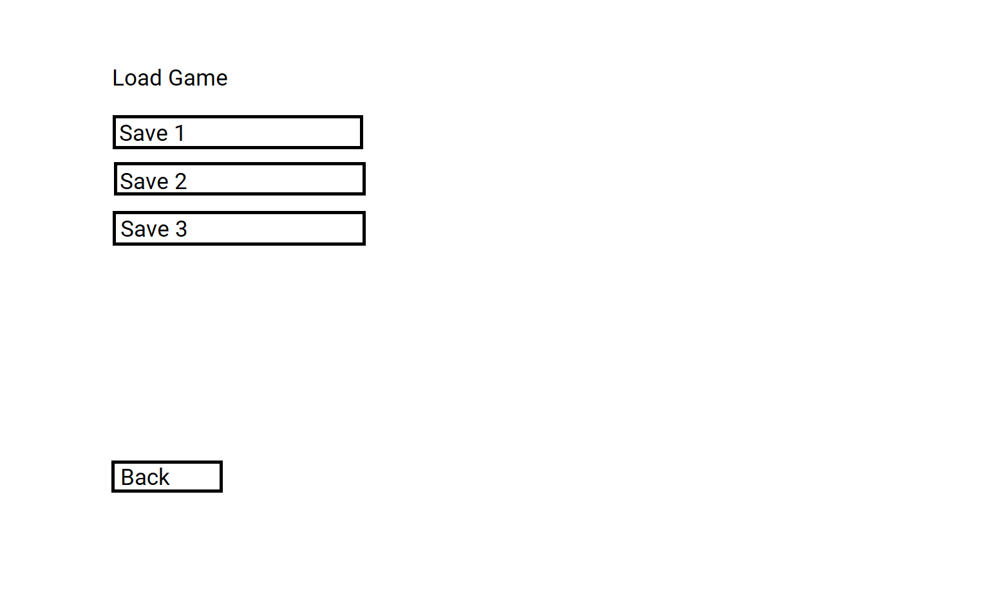
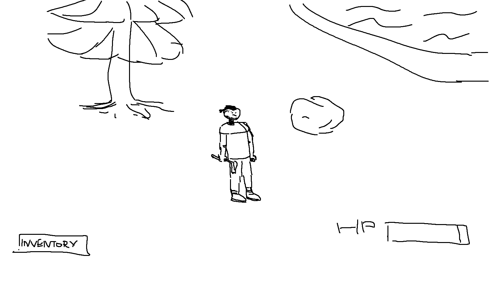

# Requirements Document
## 1. Introduction
### 1.1. Purpose 
"Aptrgangr" it is a free survival game.
### 1.2. Analogs
* [The Long Dark](https://store.steampowered.com/app/305620/The_Long_Dark/)
* [Rust](https://store.steampowered.com/app/252490/Rust/)
* [The Forest ](https://store.steampowered.com/app/242760/The_Forest/)

## 2. User requirements
### 2.1. Programming interfaces
* Programming language - **C#**
* Game Engine - **Unity**
* IDE - **Visual Studio**
### 2.2. User interface

* Main menu

* Options menu

* Load menu

* In-game interface 
### 2.3. User characteristics
Targeted audience - any customer with free time and willing to have some entertainment.

## 3. System requirements
### 3.1. Functional requirements
* Building system
* Crafting system
* Procedural generated map
* Combat system
### 3.2 Non-functional requirements
#### 3.2.1. Quality attributes
* Auto-saves
* Changes to video quality
